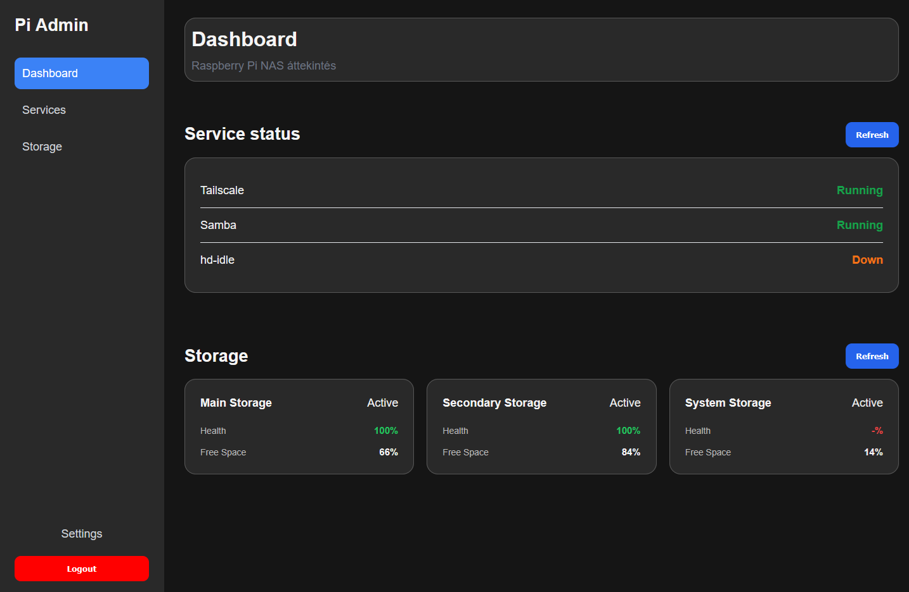

# Pi NAS Monitoring

A modern monitoring dashboard for Raspberry Pi based NAS systems.

Pi NAS Monitoring provides a clean and responsive web interface for monitoring Raspberry Pi based NAS devices. It combines a modern React frontend with an ASP.NET Core REST API to display storage information, system status and hardware health in a lightweight, easy-to-use application.

> 🚧 The project is currently under active development.

---

## 📑 Table of Contents

- [Overview](#overview)
- [Screenshots](#screenshots)
- [Features](#features)
- [Architecture](#architecture)
- [Quick Start](#quick-start)
- [Documentation](#documentation)
- [Project Structure](#project-structure)
- [Tech Stack](#tech-stack)
- [Contributing](#contributing)
- [License](#license)

---

# Overview

Pi NAS Monitoring was created to provide a simple and modern monitoring solution for Raspberry Pi powered NAS systems.

The application collects and displays important system information through an intuitive web dashboard, making it easy to monitor storage usage, hardware status and overall system health from any device on your network.

---

# Screenshots




---

# Features

- 📊 Modern React dashboard
- 💾 Storage monitoring
- ❤️ System health overview
- 🖥 Raspberry Pi optimized
- 🔐 JWT authentication
- 🌐 ASP.NET Core REST API
- ⚡ Lightweight architecture
- 📱 Responsive interface
- 📖 Swagger API documentation

---

# Architecture

```text
┌─────────────────────────────┐
│        React Frontend       │
└──────────────┬──────────────┘
               │
          REST API
               │
┌──────────────▼──────────────┐
│      ASP.NET Core API       │
└──────────────┬──────────────┘
               │
      Linux System Commands
               │
     HD Sentinel / Storage
               │
        Raspberry Pi
```

---

# Quick Start

Clone the repository.

```bash
git clone https://github.com/Dzsepetto/pi-nas-monitoring.git
```

### Backend

```bash
cd pi-admin-api
dotnet restore
dotnet run
```

### Frontend

```bash
cd pi-admin
npm install
npm run dev
```

For a complete installation guide, see the documentation below.

---

# Documentation

| Document | Description |
|----------|-------------|
| [Installation](docs/installation.md) | Complete installation guide |
| [Quick Start](docs/quick-start.md) | Get up and running quickly |
| [Configuration](docs/configuration.md) | Environment variables and configuration |
| [Raspberry Pi](docs/raspberry-pi.md) | Raspberry Pi specific setup |
| [HD Sentinel](docs/hdsentinel.md) | HD Sentinel integration |
| [API](docs/api.md) | REST API documentation |
| [Architecture](docs/architecture.md) | Application architecture |

---

# Project Structure

```
pi-nas-monitoring/
│
├── pi-admin/              # React frontend
├── pi-admin-api/          # ASP.NET Core Web API
├── docs/                  # Project documentation
├── scripts/               # Utility scripts
└── .github/               # GitHub workflows
```

---

# Tech Stack

| Technology | Purpose |
|------------|---------|
| ASP.NET Core 8 | Backend API |
| React 19 | Frontend |
| Vite | Frontend tooling |
| React Router | Routing |
| JWT | Authentication |
| Swagger | API documentation |
| Raspberry Pi OS | Target platform |
| Linux | System monitoring |

---

# Contributing

Contributions are welcome!

If you would like to improve Pi NAS Monitoring:


0. Contact me: pinterbence2002@gmail.com (optional)
1. Fork the repository.
2. Create a feature branch.
3. Commit your changes.
4. Open a Pull Request.

Bug reports, feature requests and suggestions are always appreciated.

---

# License

This project is licensed under the MIT License.

See the [LICENSE](LICENSE) file for details.