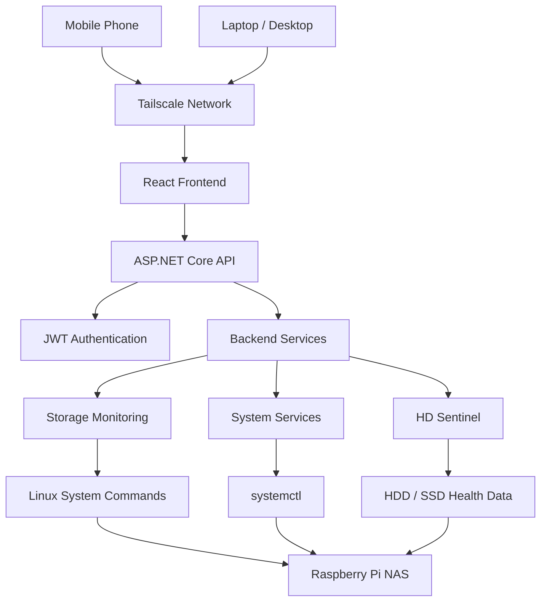
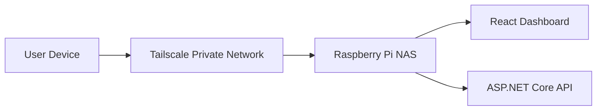
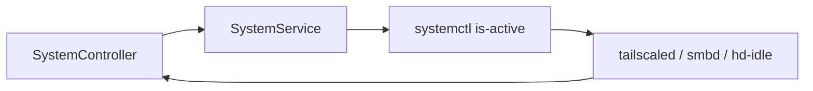
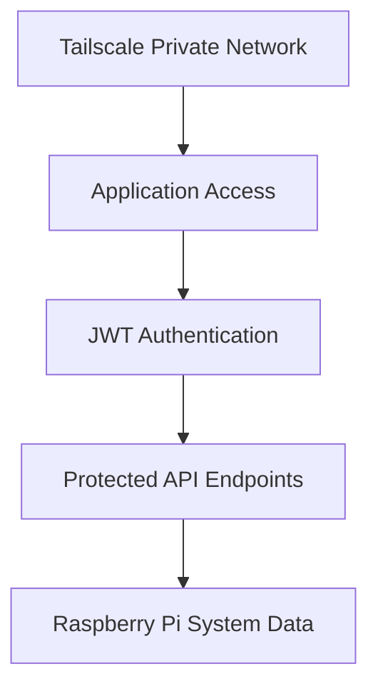

# Architecture

Pi NAS Monitoring is designed to run on a Raspberry Pi based NAS server inside a private Tailscale network.

The application is not intended to be exposed directly to the public internet. Remote access is handled through Tailscale, so the dashboard can be reached securely from trusted devices such as a laptop or mobile phone.

---

## System Overview



---

## Main Components

| Component | Description |
|----------|-------------|
| React Frontend | Web dashboard used from browser or mobile |
| ASP.NET Core API | Backend REST API |
| JWT Authentication | Protects API endpoints |
| Tailscale | Provides secure private remote access |
| Raspberry Pi | Hosts the NAS and monitoring services |
| HD Sentinel | Provides disk health information |
| Linux Commands | Used for storage and service status data |

---

## Network Architecture

The application is intended to be accessed through a private Tailscale network.



This means:

- The Raspberry Pi does not need to expose the dashboard publicly.
- Trusted devices can access the dashboard remotely through Tailscale.
- The API and frontend remain inside the private network.
- Mobile access is possible as long as the phone is connected to the same Tailscale network.

---

## System Service Monitoring

The backend checks important Raspberry Pi NAS services through `systemctl`.

Currently monitored services include:

| Service | Purpose |
|--------|---------|
| tailscaled | Tailscale connectivity |
| smbd | Samba file sharing |
| hd-idle | Disk idle / power management |



---

## API Layer

The backend exposes REST endpoints grouped by responsibility.

| Controller | Purpose |
|-----------|---------|
| AuthController | Login and JWT token generation |
| DashboardController | Dashboard summary data |
| StorageController | Storage device and space information |
| StorageOverviewController | Combined storage overview |
| SystemController | System service status |
| HDSentinelController | HD Sentinel disk health data |

---

## Project Structure

```text
pi-nas-monitoring/
│
├── pi-admin/              # React frontend
│   └── src/
│
├── pi-admin-api/          # ASP.NET Core backend
│   └── pi-admin-api/
│       ├── Controllers/
│       ├── Services/
│       ├── Services/Interfaces/
│       ├── Models/
│       └── Program.cs
│
├── docs/                  # Documentation
├── scripts/               # Setup and deployment scripts
└── README.md
```

---

## Security Model

Pi NAS Monitoring uses multiple layers of protection:



Security assumptions:

- The app is accessed through Tailscale, not the public internet.
- Only trusted devices should be part of the Tailscale network.
- API endpoints are protected with JWT authentication.
- Sensitive configuration should be stored in `.env` or local configuration files.

---


## Design Goal

The main goal of this architecture is to keep the system:

- lightweight
- simple to deploy
- secure through private networking
- usable remotely through Tailscale
- optimized for Raspberry Pi based NAS systems